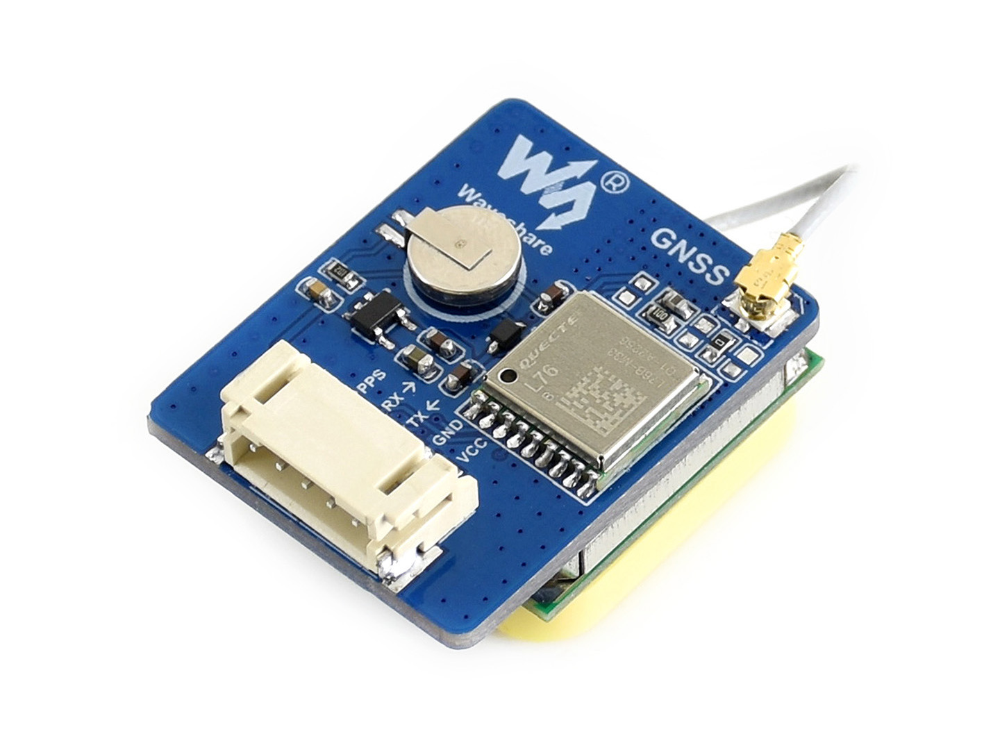

# Pan-Tilt HAT  
## waveshare electronics

http://www.waveshare.net  
https://www.waveshare.com  

http://www.waveshare.net/shop/L76X-GPS-Module.htm

http://www.waveshare.com
I am a GNSS (Global Navigation Satellite System) module that supports GPS, Beidou (BDS) and QZSS multi-satellite systems, with the advantages of fast positioning, accurate positioning and low power consumption.

## Wiki

https://www.waveshare.com/wiki/L76X_GPS_Module

note:
Uploaded only for the Raspberry Pi driver.

# micropyGPS
https://github.com/inmcm/micropyGPS.git